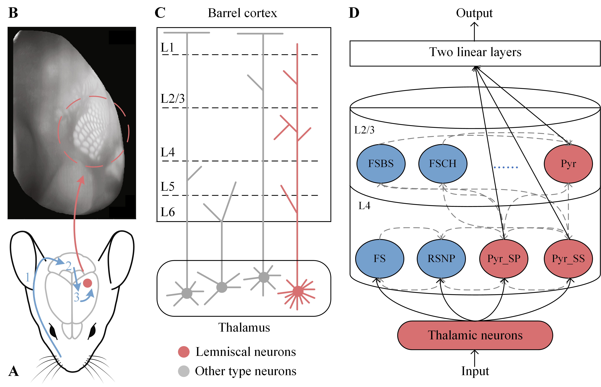

# BarrelCortexRSNN  

Train and evaluate a recurrent spiking neural network that is biologically constrained by the mouse barrel cortex. The paper is [here](https://openreview.net/forum?id=UvfI4grcM7&referrer=%5BAuthor%20Console%5D(%2Fgroup%3Fid%3DICLR.cc%2F2025%2FConference%2FAuthors%23your-submissions)).
# Dependencies
Python==3.8, h5py==3.10.0, pytorch==2.1.1. 
Install the dependencies from the `requirements.txt` file:   
`pip install -r requirements.txt`
# File Description
* `/data/`:  Three `.npy` files that store the anatomical information of the barrel cortex, two `.h5` files of datasets, and some additional trained `.pth` files. The `.h5` and `.pth` files can be downloaded from [here](https://pan.quark.cn/s/6d41efaccd6c).
* `whisker_dataset.py`:  Load the whisker sweep dataset, including the real-valued form and the spiking-based form.
* `RSNN_bfd_SpikingBased.py`: Train the model on the spiking whisker sweep dataset and plot the neural firing selectivity.
* `RSNN_bfd_RealValued.py`: Train the model on the real-valued whisker sweep dataset.
* `RSNN_bfd_whisker_deprivation.py`: Test the performance of the trained model in response to the whisker deprivation experiment.
* `SparseLinear.py`: Sample the connections between neural subtypes based on projection intensities.
* `utils.py`: Plot the neural raster, dynamic gradient, weighted degree distribution, and CV measure.
# Dataset
The whisker sweep dataset used was modified from this [repository](https://github.com/neuroailab/whisker_model). We are grateful to the author for providing us with the `v-hacd` processed 3D .hdf5 files. To be frank, compiling this project was quite troublesome, so it is recommended to directly download the [.h5 files](https://pan.quark.cn/s/6d41efaccd6c) that we have processed.

The neuron types, quantities, and connection probabilities referred to by our model are from this [repository](https://github.com/DepartmentofNeurophysiology/Cortical-representation-of-touch-in-silico-NetPyne). We have replicated the network constructed based on `NetPyNE`, and then calculated the connection probabilities by `connection quantity / (the number of presynaptic neurons × the number of postsynaptic neurons)`.
# Train
The code is almost one-click runnable. Once the dataset `.h5` files are correctly placed under the `./data/` path, running `RSNN_bfd_RealValued.py` and `RSNN_bfd_SpikingBased.py` will train the model on the real-valued and spiking-based whikser sweep dataset, respectively. For example:
```python
#./RSNN_bfd_SpikingBased.py
if __name__ == '__main__':  
    train(init_b=0.04, init_w=0.06, batch_size=128)
```

